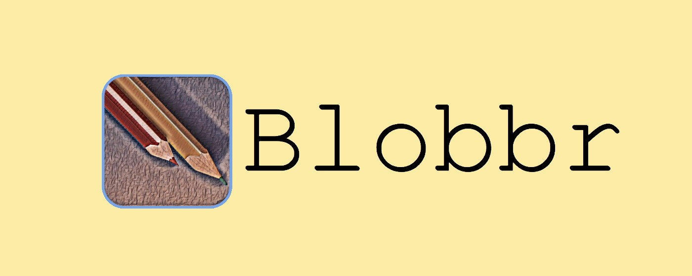
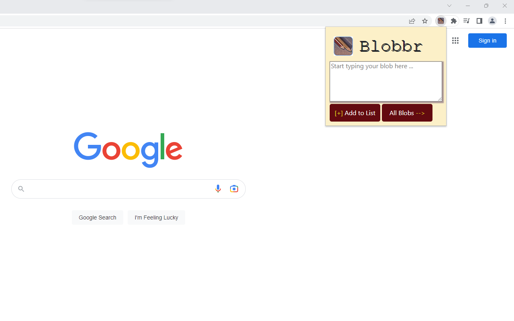
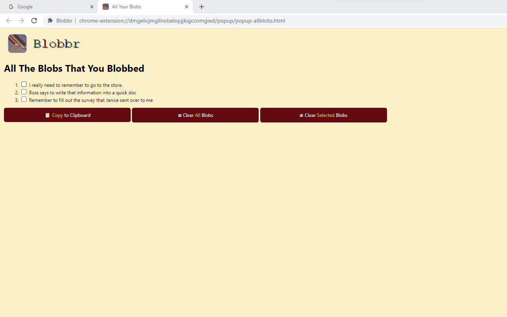

# blobbr - Chrome Extension
The Quick to-do list note-taker for the fast worker who context switches too much to know where to write things down. Grab all of your to-dos (blobs) whenever you're list stops growing and start to tackle those items one by one. Allows for quick copy to clipboard for transport of information into workflow automation, text editors, slack messages, etc.

Very good tool for those working as programmers, those working in startup companies, and those that have jobs that constantly require them to context switch and don't have the time to jot items down onto sticky notes, calendars, or planners (probably because they don't know where the item needs to go yet).

## Concept Images




## Installation/Setup
You can install this Chrome extension into your Chrome browser ***FREE*** by searching ```blobbr``` in the [Chrome Web Store](https://chrome.google.com/webstore/category/extensions) and clicking the ```Add to Chrome```.

## User Warnings
Currently, blobbr will erase all of your blobs in the blob list if you re-install the extension into Chrome, or if you decided to update blobbr in ```chrome://extensions/```. This is going to be fixed in a future release. However, the intended use of blobbr is to blob all of your thoughts during the day, and then relocate those blobs at the end of the day elsewhere or to take care of those blobs; it is not intended for long-term storage.
